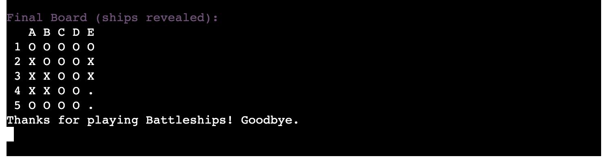

# BATTLE-LOGIC-GAME

# Battleship Game

Welcome to the Battles Logic Game! A fun and simple command-line Battleship game written in Python!
The game generates a hidden board of ships, and you try to sink them by guessing their coordinates.
The project highlights how traditional board games can be adapted into an engaging, interactive programming project.
The game is optimized for desktop environments and can be extended into web applications for wider accessibility.In here [BattleLogicGame](https://battle-logic-game-aee4b43a316c.herokuapp.com/) is the live link of the game.


## Project Overview

1. This project recreates the classic game of Battleship, allowing users to guess ship positions, track their progress, and view a colorful representation of hits and misses.
2. It encourages logical thinking, memory, and strategic planning.
3. Although primarily a console-based application, it is organized in a scalable way for future web development.

---

## How to play:

  1. Click this *[link](https://battle-logic-game-aee4b43a316c.herokuapp.com/)* or copy this text: `https://battle-logic-game-aee4b43a316c.herokuapp.com/` and paste it in your browser's address bar.
  2. As soon as the page is loaded, click 'RUN PROGRAM'.
  3. Learn the rules.
  4. Read the instruction carefully then click 'Enter' on your keyboard and have some fun.
  5. Play one more time and try to enter different grid sizes to have even more fun.
  6. As soon as you are tired of the game, choose "Exit".

  Link to the game: *https://battle-logic-game-aee4b43a316c.herokuapp.com/*

## User Stories

## User Story

- As a **new player** i want simple, clear instructions so I can start playing quickly.

- As a **returning player** I want the option to pick a different board size to keep the game challenging.

- As a **competitive player** I want to track how many turns it takes me to win so I can improve my performance.

## User Goals

- **Understand the game easily:** Clear prompts and colorful messages help the player throughout.

- **Track perfomance:** The number of turns and missed guesses are displayed.

- **Replayability:** Randomized ship placement ensures every game is different.

- **Accessible interface:** Simple command-line inputs.

## Features

- **When the program is loaded**

   - The user can see a welcome message introducing the Battleship game.

   - Followed by a detailed set of rules which are required to be followed.

   - The game begins by prompting the user to choose a grid size (between 5-10).

   

- **During gameplay**

   - Guess ship locations using coordinates like A1, B4, etc.

   - A live board is shown after every move.

   - Hits and misses are displayed in color.

   - Missed guesses are tracked and formatted clearly as (A1), (B2).

   - The number of turns and ship parts remaining are shown.

   

- **When the game ends**

   - The player is notified when all ships are sunk, along with the number of turns taken. The full board is revealed.

   

- **When the user selects "Exit"**

   - A friendly goodbye message is shown and the program will be stopped.

   
   

---

## Technologies Used

### Languages:


---

## File Structure

```
BATTLE-LOGIC-GAME/
├── board.py          # Contains the Board class logic
├── game.py           # Game functions like input parsing and starting the game
├── run.py            # Entry point to start the game
├── requirements.txt  # List of Python packages
├── Procfile          # For Heroku deployment
└── README.md         # This file
```

---

## How to run the project locally

1. Clone the repository:
   ```bash
   git clone [repository url](https://github.com/kenneth2-3/battle-logic-game).git
   cd battle-logic-game
   ```

2. Create a virtual environment:
   ```bash
   python3 -m venv venv
   source venv/bin/activate  # For Windows: venv\Scripts\activate
   ```

3. Install dependencies:
   ```bash
   pip install -r requirements.txt
   ```

4. Run the game:
   ```bash
   python run.py
   ```

---

## Customization

You can easily **customize** the game:

- Change grid sizes in game.py inside start_game().

- Modify the board display in board.py.

- Add more complex ship layouts (L-shapes, diagonals).

---

## Screenshots


## Testing 


## Deployment

## Heroku Deployment (for the console)

Normally Heroku is best for web apps. This is a terminal game, but it can be adapted.

if you want to deploy:

1. Create a requirements.txt file:
   ```bash
   pip freeze > requirements.txt
   ```
2. Create a Procfile:
   ```bash
   web: node index.js
   ```

---

## Local deployment 

To make a local copy of this project, you can clone it. In your IDE Terminal, type the following command:

   - git clone [repository-url](https://github.com/kenneth2-3/battle-logic-game)

## Author

Kenneth Adanma

Thank you for exploring Battle-logic-game!