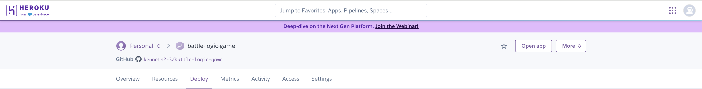

# BATTLE-LOGIC-GAME

# Battleship Game

Welcome to the Battles Logic Game! A fun and simple command-line Battleship game written in Python!
The game generates a hidden board of ships, and you try to sink them by guessing their coordinates.
The project highlights how traditional board games can be adapted into an engaging, interactive programming project.
The game is optimized for desktop environments and can be extended into web applications for wider accessibility.In here [BattleLogicGame](https://battle-logic-game-aee4b43a316c.herokuapp.com/) is the live link of the game.


## Project Overview

1. This project recreates the classic game of Battleship, allowing users to guess ship positions, track their progress, and view a colorful representation of hits and misses.
2. It encourages logical thinking, memory, and strategic planning.
3. Although primarily a console-based application, it is organized in a scalable way for future web development.

---

## How to play:

  1. Click this *[link](https://battle-logic-game-aee4b43a316c.herokuapp.com/)* or copy this text: `https://battle-logic-game-aee4b43a316c.herokuapp.com/` and paste it in your browser's address bar.
  2. As soon as the page is loaded, click 'RUN PROGRAM'.
  3. Learn the rules.
  4. Read the instruction carefully then click 'Enter' on your keyboard and have some fun.
  5. Play one more time and try to enter different grid sizes to have even more fun.
  6. As soon as you are tired of the game, choose "Exit".

  Link to the game: *https://battle-logic-game-aee4b43a316c.herokuapp.com/*

## User Stories

## User Story

- As a **new player** i want simple, clear instructions so I can start playing quickly.

- As a **returning player** I want the option to pick a different board size to keep the game challenging.

- As a **competitive player** I want to track how many turns it takes me to win so I can improve my performance.

## User Goals

- **Understand the game easily:** Clear prompts and colorful messages help the player throughout.

- **Track perfomance:** The number of turns and missed guesses are displayed.

- **Replayability:** Randomized ship placement ensures every game is different.

- **Accessible interface:** Simple command-line inputs.

## Features

- **When the program is loaded**

   - The user can see a welcome message introducing the Battleship game.

   - Followed by a detailed set of rules which are required to be followed.

   - The game begins by prompting the user to choose a grid size (between 5-10).

   

- **During gameplay**

   - Guess ship locations using coordinates like A1, B4, etc.

   - A live board is shown after every move.

   - Hits and misses are displayed in color.

   - Missed guesses are tracked and formatted clearly as (A1), (B2).

   - The number of turns and ship parts remaining are shown.

   

- **When the game ends**

   - The player is notified when all ships are sunk, along with the number of turns taken. The full board is revealed.

   

- **When the user selects "Exit"**

   - A friendly goodbye message is shown and the program will be stopped.

   
   

---

## Technologies Used

### Languages:

- [Python 3.12.8](https://www.python.org/downloads/release/python-3128/): used to anchor the project and direct all application behavior.

- [Javascript](https://www.javascript.com): used to provide the start script needed to run the Code Institute mock terminal in the browser.

- [HTML](https://www.w3schools.com): used to construct the elements involved in building the mock terminal in the browser.

### Frameworks/Libraries, Programmes and Tools:
#### Python modules/packages:

##### Standard library imports:

- [random](https://docs.python.org/3/library/random.html) was used to implement pseudo-random number generation.
- [string](https://docs.python.org/3/library/string.html) was used to provide additional tools for working with strings, such as predefined character sets and more advanced formatting capabilities.

##### Third-party imports:

- [Simple Terminal Menu](https://pypi.org/project/simple-term-menu/) was used to implement the menu.
- [Colorama](https://pypi.org/project/colorama/) was used to add colors and styles to the project.

#### Other tools:

- [VSCode](https://code.visualstudio.com/) was used as the main tool to write and edit code.
- [Git](https://git-scm.com/) was used for the version control of the website.
- [GitHub](https://github.com/) was used to host the code of the website.
- [Heroku](https://dashboard.heroku.com/) was used to deploy the project.

---

## File Structure

```
BATTLE-LOGIC-GAME/
├── board.py          # Contains the Board class logic
├── game.py           # Game functions like input parsing and starting the game
├── run.py            # Entry point to start the game
├── requirements.txt  # List of Python packages
├── Procfile          # For Heroku deployment
└── README.md         # This file
└── TESTING.md        # For test related documentation
```

---

## Customization

You can easily **customize** the game:

- Change grid sizes in game.py inside start_game().

- Modify the board display in board.py.

- Add more complex ship layouts (L-shapes, diagonals).

---

## Bugs

+ **Solved bugs**

1. The python virtual environment was not showing in the terminal.
   - *Solution* 
     ```bash
     ls
     ```

     ```bash
     source venv/bin/activate  #To activate it
     ```

2. The ships were visible to the player instead of being hidden.
   - *Solution* rewrote the code to display '.' instead of 'S' unless the ship has been hit.(i.e turned to 'X').
      ```python
      def print_board(self, reveal_ships=False):

      # Print column labels
      print("  ", end="")
      for col in range(self.size):
        print(chr(65 + col), end=" ")
        print()

      # Print rows with row numbers
      for row in range(self.size):
        print(f"{row + 1:2} ", end="")
        for col in range(self.size):
            cell_value = self.grid[row][col]
            if reveal_ships:
                print(cell_value, end=" ")
            else:
                if cell_value == 'S':
                    print('X', end=" ")  # To hide ships during the game
                else:
                    print(cell_value, end=" ")
        print()
      ```

+ **Unsolved bugs**

  - None

---

## Testing 

Please refer to the [TESTING.MD](TESTING.md) file for all test related documentation.

---

## Deployment

- The program was deployed to [Heroku](https://dashboard.heroku.com/).
- The program can be reached by the [Link](https://battle-logic-game-aee4b43a316c.herokuapp.com/).

### To deploy the project as an application that can be **run locally**:

*Note:*
  1. This project requires you to have Python installed on your local PC:
  - `sudo apt install python3`

  1. You will also need pip installed to allow the installation of modules the application uses.
  - `sudo apt install python3-pip`

Create a local copy of the GitHub repository by following one of the two processes below:

- Download ZIP file:
  1. Go to the [GitHub Repo page](https://github.com/kenneth2-3/battle-logic-game).
  1. Click the Code button and download the ZIP file containing the project.
  1. Extract the ZIP file to a location on your PC.

- Clone the repository:
  1. Open a folder on your computer with the terminal.
  1. Run the following command
  - `git clone https://github.com/kenneth2-3/battle-logic-game.git`

### To deploy the project to Heroku so it can be run as a remote web application:

- Clone the repository:
  1. Open a folder on your computer with the terminal.
  2. Run the following command
  - `git clone https://github.com/kenneth2-3/battle-logic-game.git`

  3. Create your own GitHub repository to host the code.
  4. Run the command `git remote set-url origin <Your GitHub Repo Path>` to set the remote repository location to your repository.

  5. Push the files to your repository with the following command:
  `git push`
  6. Create a Heroku account if you don't already have one here [Heroku](https://dashboard.heroku.com/apps)
  7. Create a new Heroku application on the following page here [Heroku App](https://dashboard.heroku.com/new-app):

      - 
   8. Go to the Deploy tab:

     - 

     - 

   9. Link your GitHub account and connect the application to the repository you created. 

     - 

   10. Go to the Settings tab:
  
     - 

   11. Click "Add buildpack" and add the Python and Node.js buildpacks in the following order:

     - 

   12. Click "Reveal Config Vars"

     - 

   13. Add 1 new Config Vars:
     - Key: PORT Value: 8000
     - *This Config was provided by [CODE INSTITUTE](https://codeinstitute.net/)*.

   14. Go back to the Deploy tab:

     - 

   15. Click "Deploy Branch"

     - 
     - Wait for the completion of the deployment.
     - 

   16. Click "Open app" to launch the application inside a web page.
     - 

---

## Credits

- Terminal menu: [Simple Terminal Menu](https://pypi.org/project/simple-term-menu/).
- [Heroku](https://dashboard.heroku.com/) for hosting the application.
- Color formatting: [Colorama](https://pypi.org/project/colorama/).

## Author

Kenneth Adanma

Thank you for exploring Battle-logic-game!