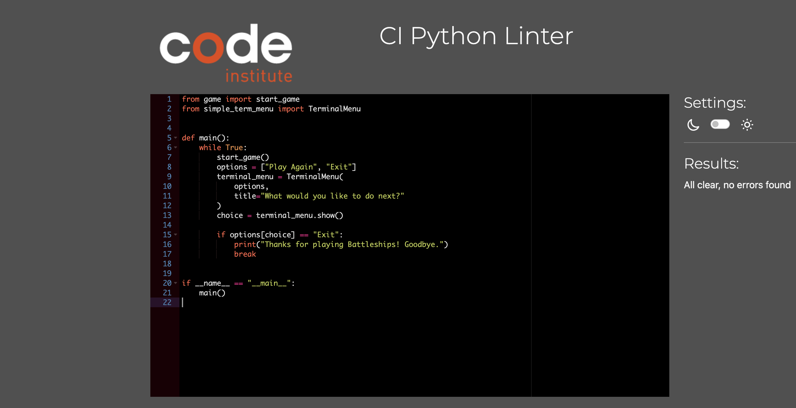
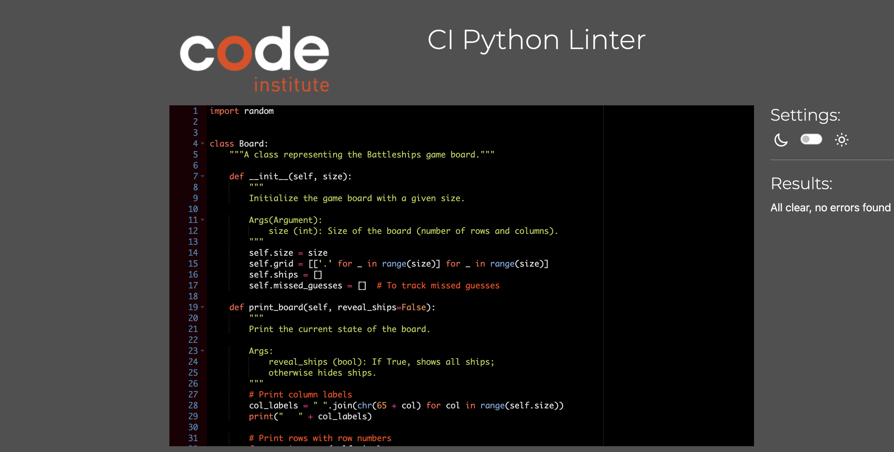
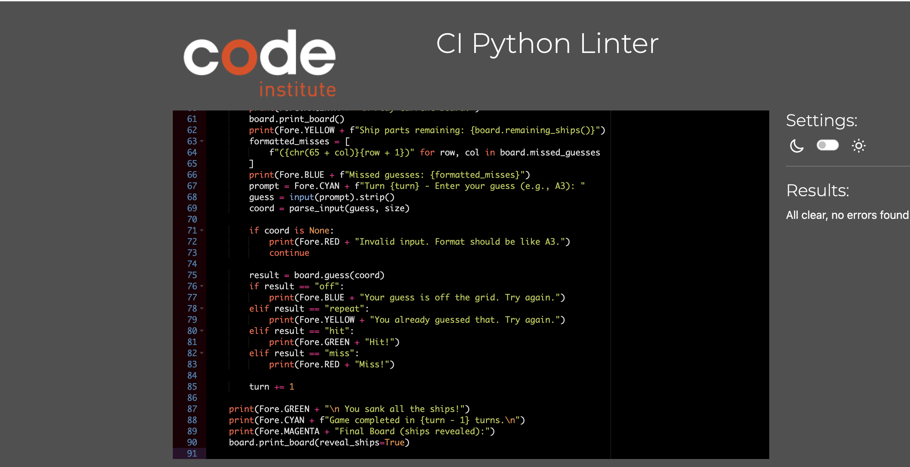
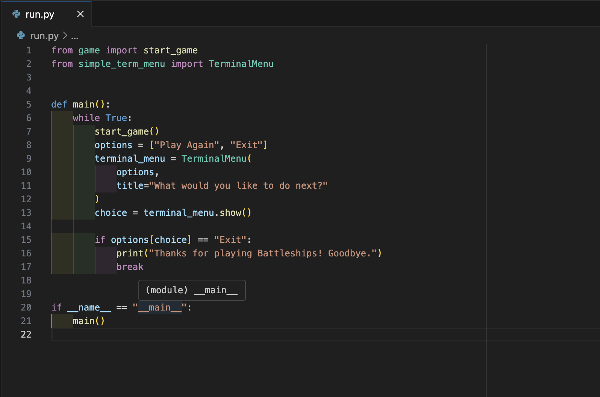
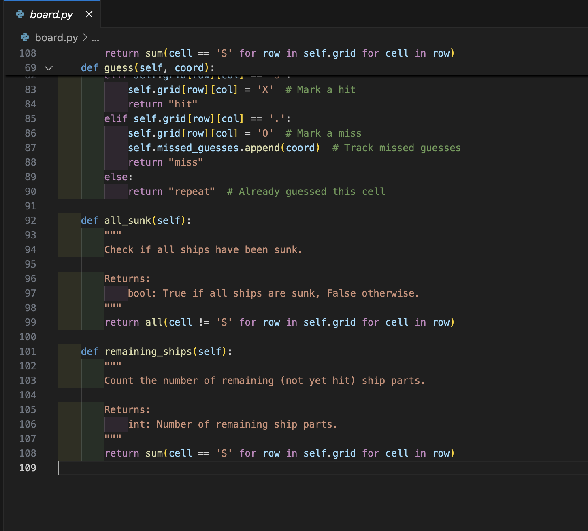
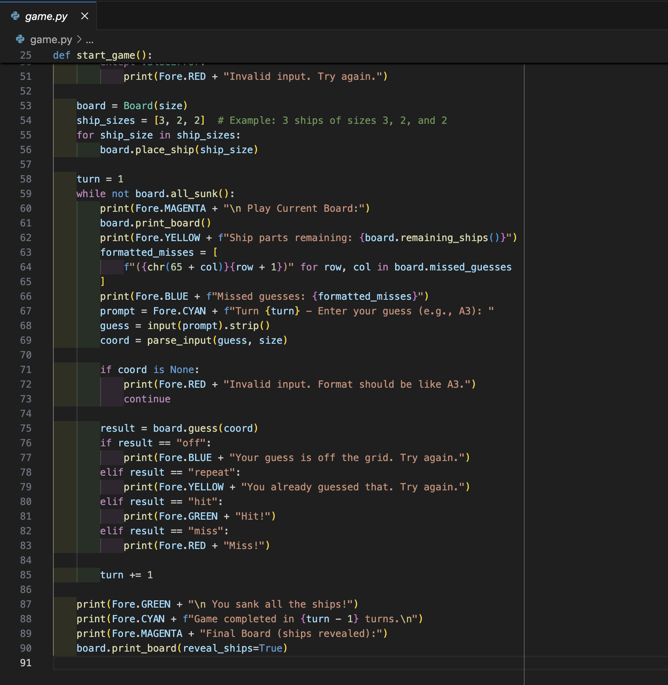

## TESTING

The program was tested constantly during its development process.
Other users also tested it in order to spot possible grammatical mistakes that the code may present.

### Validators 

Code Institute's [online validation tool](https://pep8ci.herokuapp.com/) was used to ensure that all of the projects Python source code is [Pep 8-compliant](https://legacy.python.org/dev/peps/pep-0008/). This checking was done manually by copying python code and pasting it into the validator.

- **run.py**

- **board.py**

- **game.py**

---

## Issues with validating the code

Since the validator may show that there is missing line at the end of the code in some files
and that github does not show the last empty lines in all files, I will add the following
screenshots. These screenshots show that the code is structured according to PEP8 requirements
completely:

- **run.py**

- **board.py**

- **game.py**

